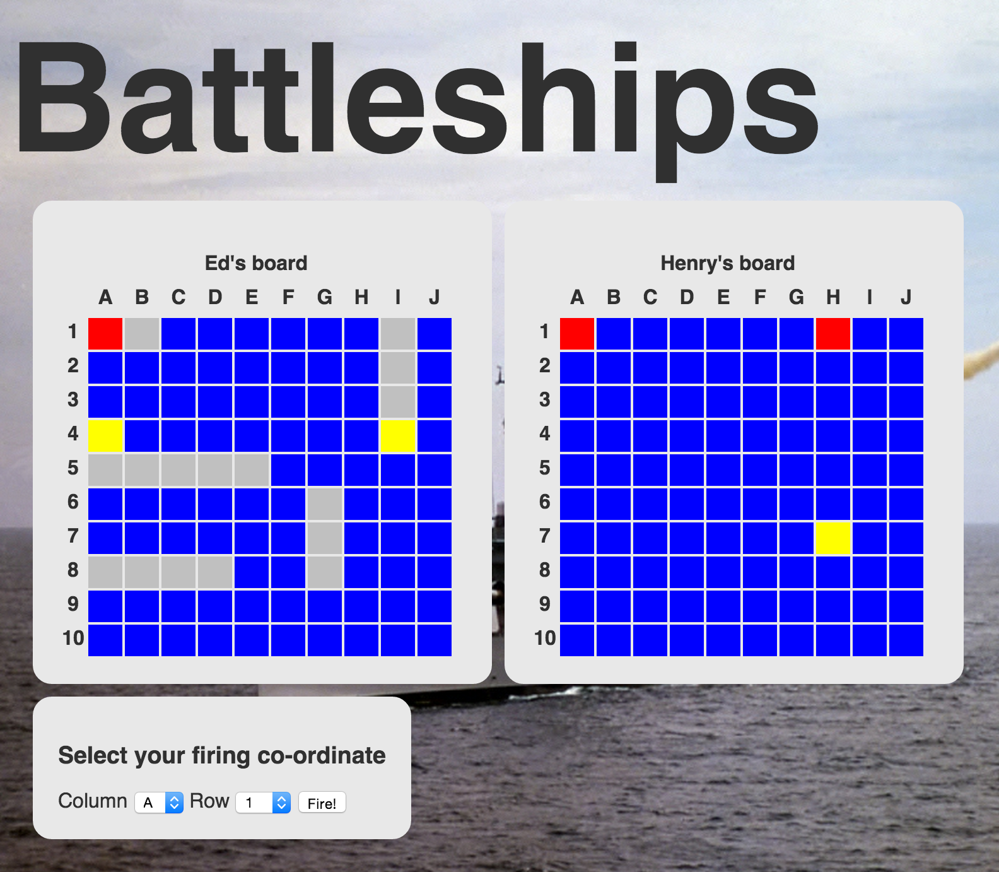

[](https://codeclimate.com/github/ejbyne/battleships-web-app)
[](https://codeclimate.com/github/ejbyne/battleships-web-app)

# Battleships

## Summary

In Weeks 2 and 3 at Makers Academy I built a Battleships web application with my pairing partner, [Richard Lake](https://github.com/ralake).

Week 2 was spent developing the game logic in Ruby, with a focus on object oriented programming. In Week 3 we learnt how to use the Sinatra web framework, and used behaviour driven development to create a fully functional web game.

This was a really exciting project, as after many weeks of learning to code it was the first time we managed to integrate our own code into a web framework and see a visible product in a browser window.

## Technologies used

- Ruby
- Sinatra
- RSpec
- Cucumber
- Capybara

## Collaborators
- [Ed Byne](https://github.com/ejbyne)
- [Richard Lake](https://github.com/ralake)

## Instructions

The live version of the game is available at <a href="https://battleships-web-app.herokuapp.com">https://battleships-web-app.herokuapp.com</a>

To try the game locally, please clone this repository on your machine:

```
$ git clone https://github.com/ejbyne/battleships-web-app.git
```

Change into the directory and bundle install the Ruby gems:

```
$ cd battleships-web-app
$ bundle install
```

Start the Sinatra server and visit <a href="http://localhost:9292">http://localhost:9292</a>

```
$ rackup
```

Run the tests:

```
$ rspec
$ cucumber
```

## Screenshot



## Completed tasks

### Game logic
- Design game structure using OO techniques
- Use TDD to create cell, ship, water, board, player and game classes

### Application features
- Enable two players to be registered
- Enable each player to place his or her ships
- Once both players have placed their ships, enable each player to take turns to shoot at the other's board
- Show result message once one player has lost all his or her ships

## To do list
- Improve CSS
- Allow more than one game to occur at a time
